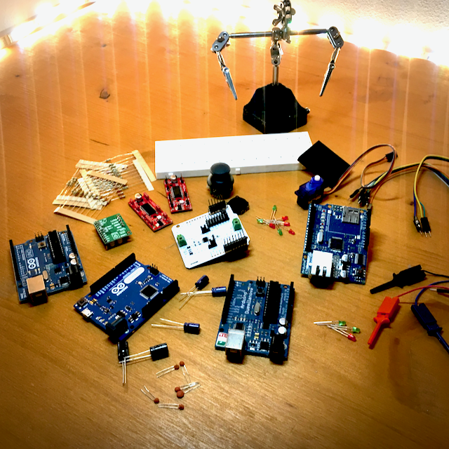

This are the Arduino boards I collected in the last 10 years.

{:class="img" style="border-radius: 8px; width:100%; display: block; margin-left: auto; margin-right: auto;"}

I bought my first arduino board back in 2009: the `Arduino 2009`!!! I remember I was enthusiastic about it and since then I played quite bit with this platform, I had a lot of fun!!!

{% include gallery-grid.html alt="image" max-width="640px" width="100%" files="03.png,04.png,05.png,06.png" %}

Here some of my boards:`Arduino 2009`, `Arduino Leonardo`, `Arduino UNO R3`, `Ethernet Shield`.

In the last years I switched to the new and more capable platforms: `Raspberry Pi`, `STM32`, `ESP32`.

Information about the products, about the related software and about che community could be found @ [`Arduino Homepage`][arduino-homepage]

[arduino-homepage]: https://www.arduino.cc