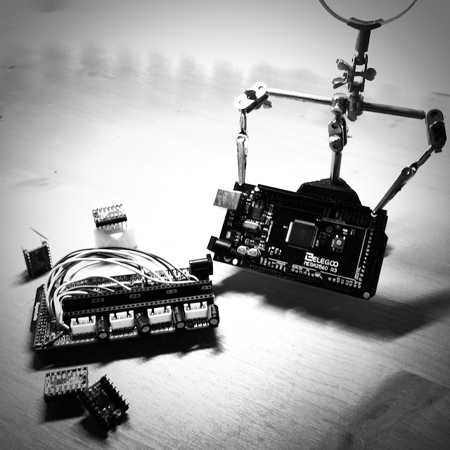

In November 2018 I read about the Trinamic stepper driver `TMC2130` and ...

{:class="img" style="border-radius: 8px; width:50%; height_:200px; display: block; margin-left: auto; margin-right: auto;"}

It tooks 3 days and around 250 tin welding with my trusty `HAKKO Fx-888` welder for complete the shield ...

{:class="img" style="border-radius: 8px; width:200px; height:200px;"}
{:class="img" style="border-radius: 8px; width:200px; height:200px; "}