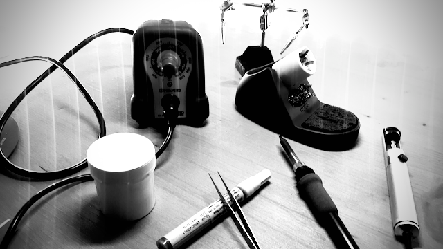

{:class="img" style="border-radius: 8px; width:100%; display: block; margin-left: auto; margin-right: auto;"}

I bought this `HAKKO Fx-888` back in 2012 and after so many years and a ton of tin solders this iron solder is still top notch.

{% include gallery-grid.html alt="image" max-width="640px" width="100%" files="02.png,03.png,04.png,05.png" %}

