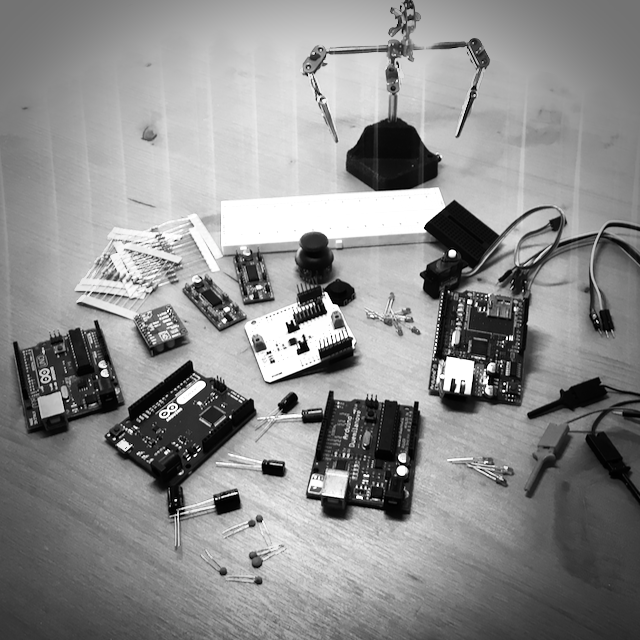

This are my Raspberry Pi boards.

{:class="img" style="border-radius: 8px; width:100%; display: block; margin-left: auto; margin-right: auto;"}

I bought ...

{% include gallery-grid.html alt="image" max-width="640px" width="100%" files="01.png,01.png,01.png,01.png" %}

Here some of my boards:`Arduino 2009`, `Arduino Leonardo`, `Arduino UNO R3`, `Ethernet Shield`.

