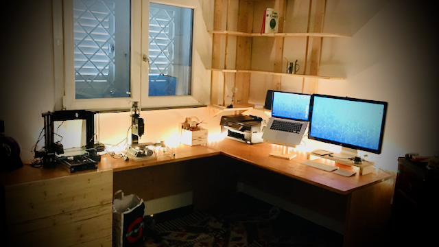

It was quite long that I was thinking to change my old working desk with a new one.
I've been looking for a long time for a desk I might like with no luck and after some doubts I decided that I could have built one myself.

This is the final result

{:class="img" style="border-radius: 8px; width:100%; display: block; margin-left: auto; margin-right: auto;"}

I started designing the desk with `Fusion360`. It took some time to get used to the new tools, the learning curve is definitely challenging but the results are certainly satisfying.

Below the model of the desk



and the one of the bookshelf



All the process, from design through the choice of the wood, the cutting, the assembly, the sanding, till the final painting took 3 weeks, definitely a challenging job but I'm enjoying the result every day.

